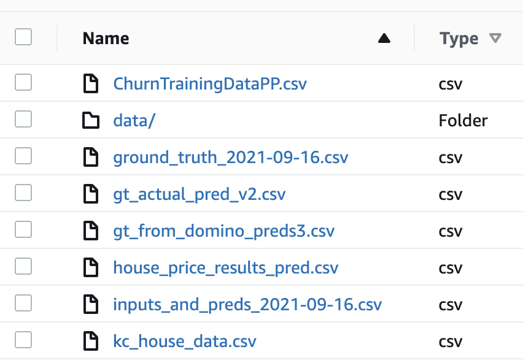
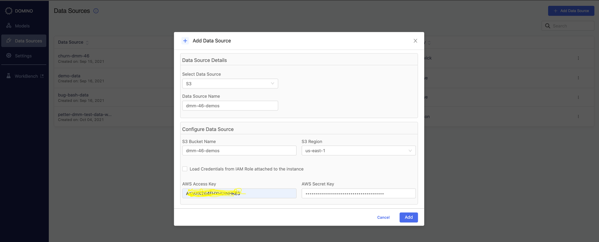

# Domino Model Monitoring Workshop
This workshop is designed to introduce Domino model monitoring workflows. It is designed to be self-guided and all necessary code and data are included.

## Datasets Used
### KC House Data
Online property companies offer valuations of houses using machine learning techniques. The aim of this report is to predict the house sales in King County, Washington State, USA using Multiple Linear Regression (MLR). The dataset consisted of historic data of houses sold between May 2014 to May 2015.

https://www.kaggle.com/datasets/shivachandel/kc-house-data

### Customer Churn Data
This dataset contains the customer churn prediction data based on dropped calls for a mobile operator.

## Domino Model Monitoring
There are two types of model monitoring workflows available in Domino. 

- ## Model API Monitoring
When a model is deployed on Domino as a Model API, 

- Domino Analyzes the training data to extract the model schema (if you register a Domino TrainingSet).

- Captures predictions as Domino datasets for monitoring.

- Generates drift detection and model quality analysis on a schedule (if you share the ground truth dataset with Domino), and alerts you if any thresholds are exceeded.

- Allows you to easily reproduce the environment with access to the captured predictions to diagnose and fix issues with your model.

See Set up monitoring for Model APIs in the Docs, https://docs.dominodatalab.com/en/latest/user_guide/2a7c3b/set-up-monitoring-for-model-apis/


If you do not want Domino to manage the prediction data collection, use the Model Monitor to configure monitoring, even for Model APIs.


- ## Model Monitor
For models deployed as other assets on Domino (App, Launcher, or Job) or external to Domino, you can use Domino to:

- Connect to the data source where the training, prediction, and ground truth data reside.

- Register a model’s entry along with its schema.

- Set up drift detection and model quality monitoring by registering the location of every new batch of prediction or ground truth data.

- Set up a schedule for Domino to run drift and model quality checks periodically and alert you if thresholds are exceeded.

See Set up Model Monitor in the docs, https://docs.dominodatalab.com/en/latest/user_guide/679cc1/set-up-model-monitor/

## Prerequisites
- Access to a Domino deployment with a practitioner role.
- Fork this repository to your own repository or use a zip file to upload the content into a Domino project. You can create a Git based project with a forked project or import it as a git repository.
- Access to AWS S3 bucket to store the training, prediction, and ground truth data. Copy the csv files inside the sample-data in to the S3 bucket.



## Monitoring Model APIs
In this section, we will 
- Create a sample model
- publish a model API
- Create a training set
- Create data capture client to capture prediction data
- Generate Predictions
- Examine Predictions
- Create a DMM data source
- Configure ground truth data


### Create a Sample model
In this section, We will also create an example model that we can use in the later sections.

**Step1:**

Create a workspace with Jupyter Lab IDE in the project and open the `0-Create-and-Train-Model.ipynb`. We are going to use the kc_house_data.csv in the sample-data folder to create the training set. Note you can use a dataset from a Domino Data Source if you wish. Just read the data from the data source into the dataset_raw.

**Step2:**

Execute the cells in order to:
- Create training and test data sets for the model. 
- Then train the Mdoel with DecisionTreeRegressor.
- Create a serialized model `price_dt_py.sav`.

At the end of this section, you will have a trained model.


### Publish Model API
This section set up the Model API use in the future sections that generate and store the prediction data.

**Step1:**

Review the model_API.py file and change the parameters to the `capturePrediction` call, or make changes if desired.

**Step2:**

Publish the Model API with the following:

**File name:** `model_API.py` 

**Function to invoke:** 
`predict_price`

Add the following example JSON body into the model description., so it is easy to copy and paste into the model API tester to generate sample predictions.

```
{
  "data":{
    "bedrooms" :1.417779575520277,
    "bathrooms":1.2235334622079015,
    "sqft_living":1376.2808414176138,
    "sqft_lot":-44282.09192720655,
    "floors":1.0663144705090994,
    "waterfront":-0.016425213918793445,
    "view":-0.12412711151320194,
    "condition":3.010860708305122,
    "grade":6.446308650295107,
    "sqft_above":1134.2601420161861,
    "sqft_basement":83.01687506148825,
    "yr_built":1950.9720074899026,
    "yr_renovated":38.33997291730212,
    "zipcode":98187.71575450613,
    "lat":47.512356777412954,
    "long":-122.29738607549102,
    "sqft_living15":1162.588195657737,
    "sqft_lot15":-15814.149590757263
  }
}
```

**Step3:**

Test the model using the model API tester and curl.

At the end of this section, you will have a model API ready for generating predictions.

*Note at the end of above steps, a new dataset folder called `prediction_data` will be created to store the captured prediction data in parquet format. Inside the folder the prediction data will be stored by the model version , data and hour*

```
ubuntu@run-642767ae8cdc3c20deb356f7-5cw6d:/mnt/code$ ls -l /mnt/data/prediction_data/6426faaa8cdc3c20deb356d6/\$\$date\$\$\=2023-03-31Z/\$\$hour\$\$\=16Z/
total 48
-rw-r--r-- 1 root root 45994 Mar 31 18:00 predictions_eaf15d43-2f05-41bd-9546-454c3b714a5f.parquet
ubuntu@run-642767ae8cdc3c20deb356f7-5cw6d:/mnt/code$ 
```


### Create a Training Set
In this section, you are going to create a training set that can be compared to later prediction data to monitor data drift. To read more about creating a training set see this, 
https://docs.dominodatalab.com/en/latest/api_guide/440de9/trainingsets-use-cases/

**Step1:**

Open the `1-Create-Training-Set.ipynb` notebook. 

**Step2:**

In the cell that contains a call to `Code demonstrating creation of a training set`, update the ‘training_set_name’ to a unique name of your choice and Run all cells. This will create a training set that can be associated with a model in this project.

**Step3:**

Execute the cell that contains `Example code to read the training set just created`. This will display the training set.

At the end of this section, you will have a Domino training set ready to be associated with the model published in the previous section.

### Capture prediction data
Prediction data is a combination of the inputs to the model and the predictions that are output from the model. Inputs are the values of the features that were input as API requests into the Model API. When you incorporate a Domino-provided data capture library in your Model API code, Domino automatically captures the prediction data.

The data ingestion client is part of the Domino Standard Environment (DSE) with the latest version of the client library. The client library records prediction data for deployed models.

You can read more on Domino data capture client here, https://docs.dominodatalab.com/en/latest/user_guide/93e5c0/set-up-prediction-capture/


**Step1:**

Open `2-Test-Prediction.ipynb`, and run all cells to test the functionality of the prediction function and prediction data capture. This will provide an example of the structure and format of the prediction data recorded by Domino when this model is deployed as a Domino Model API.

### Generate Predictions
In this section we will use a data-generation program to populate predictions so that we can see how the model monitor is performing.

**Step1:**

Open `3-Generate-Predictions.ipynb`. Update MODEL_API_URL and MODEL_API_KEY (the access token) to match your newly published Model API. (you can find this in the overview tab of model API -> click on Python)

**Step2:**

Update iterations to specify the number of predictions yoy want to generate. Run all cells (note that nothing will be displayed).

This will create a prediction_data folder inside the project dataset and will store the prediction data.

(NOTE: this may take up to 30 minutes to populate the prediction data in the dataset)

### Configure Data Drift Monitoring
For the Model API, enable monitoring by selecting the training set to track drift against.

Go to your newly published Model API overview page and navigate to the ‘Monitoring’ tab.

Open ‘Configure Monitoring’ > ‘Data’ to select the right training set and version and set the model type to ‘Regression’

Refresh and view drift and MQ metrics, set thresholds, etc.


### Examine Predictions
Now we’ll open a workspace directly from the published model and examine the predictions.
From your published model, click ‘Open in Workspace’ to spin up a new workspace
Open the file `4-Analyze-Predictions.ipynb`.

Update the path variable to point to the model version ID (a directory in the predictions Dataset) and execute the notebook to examine the recorded predictions.

In the end, a copy of the prediction data will be saved to a results folder as a CSV file. Sync this file to Domino and download a local copy for generating the ground truth data in the next section. An example is included in the git repo, `sample-data/model-api/preds_from_domino.csv`.

### Construct Ground Truth Data
A sample ground truth data set can be constructed based on the above predictions stored in the Domino. 

**Step1:**

First, download the predictions as a CSV file in the previous step. An example is included in the git repo, sample-data/model-api/preds_from_domino.csv.

**Step2:**

Update the predictions file to remove all columns except the event ID and then add a new column of price_pred. Update this new price_pred column to reflect the ground truth for the price. An example is included in the git repo, `sample-data/model-api/gt_from_domino_preds.csv`.

**Step3:**

Upload this ground truth data file in to the S3 bucket, so it can be access ffrom the monitoring data source for monitoring quality calculations.

### Create a DMM data source
Navigate to the Model Monitor > Monitoring Data Source > Add Data source

Enter the details for AWS S3 bucket containing the data files.



### Configure ground truth data
Add ground truth tracking to the model’s monitoring to determine model quality and accuracy metrics
From the Monitoring tab, open `Configure Monitoring` > `Data` and follow the instructions to register ground truth data.

Upon being taken to a new page to register ground truth data, upload the config that points to the data
```
{
    "variables": [
        {
            "valueType": "numerical",
            "variableType": "ground_truth",
            "name": "price_pred",
            "forPredictionOutput": "price"
        }
    ],
    "datasetDetails": {
        "name": "gt_from_domino_preds.csv",
        "datasetType": "file",
        "datasetConfig": {
            "path": "gt_from_domino_preds.csv",
            "fileFormat": "csv"
        },
        "datasourceName": "house_data_ziegler",
        "datasourceType": "s3"
    }
}
```
Where name is the name of the dataset and path is the path inside the S3 bucket.

*Note in subsequent ground truth data uploads, only include the datasetDetails section. An error will be generated if the variables section is included.*

### Review model monitoring

Now go to the model monitor section > Models > <model name> >. Review the Data traffic that shows prediction data traffic and ground trutch data traffic. Switch to the Ingest History tab tio review data ingestions.

Review data drift and model quality data.

You can schedule groud truth and model quality checks.


## Monitoring non Model APIs
The Domino model monitoring does not require an actual model artifact to perform model monitoring. There are simply three datasets that are needed to set up monitoring.

- Training Data - This is the data used to initially train your model. The schema of this data is the schema that future Prediction Data must match. The Training Data must contain a row_identifier column, at least one feature (aka input) column, and a prediction (aka a target or label) column. Note that only supervised (i.e. Classification or Regression) models trained on tabular data can be monitored in Model Monitor today. 

- Prediction Data - This is the new data that comes in that your model will make predictions on. It must contain the same feature columns and prediction column as defined in the schema of the Training Data.

- Ground Truth Data - Ground Truth represents the ‘actuals’ that are assigned to a specific row. Model Monitor computes model quality metrics by comparing the ground_truth value to the prediction value.  Ground Truth Data must also contain a row_identifier to match against prediction values.  

An example of the above situation would be a model that predicts churn_y (customer churn) based on dropperc (percentage of calls dropped),mins (minutes on calls), consecmonths (consecutive months as a customer), income, and age. A few sample rows and the schema for the model in Model Monitor would be as follows -

| custid  | dropperc | mins | consecmonths | income | age | churn_Y | predictionProbability | y_gt |
| ------------- | ------------- |------------- | ------------- |------------- | ------------- |------------- | ------------- | ------------- |
| 844336  | 0.0163  | 550 | 28 | 89.2 | 45 | 1 | [0.6, 0.4] | 0 |
| 146041  | 0.0183  | 545 | 33 | 54.2 | 43 | 0 | [0.15, 0.85] | 0 |

custid - row_identifier (string)

dropperc - feature (numeric)

mins - feature (numeric)

consecmonths - feature (numeric)

income - feature (numeric)

age - feature (numeric)

churn_Y - prediction (categorical)

predictionProbability - prediction_probability (numerical)

y_gt - ground_truth (categorical)


In the above use case - the columns [dropperc, mins, consecmonths, income, age] are used to predict churn_Y. y_gt represents the actual outcome of that particular customer - aka did they churn or did they not churn. churn_Y and y_gt are matched on custid to determine the performance of the model predictions. 

### Define data source in Model Monitor
First, define a monitoring data source. In Model Monitor click on Data Sources > Add Data Source

Fill out the fields for your new bucket like shown below


 
For credentials use your access key and secret key associated with an IAM role with read and write access to the bucket.

### Register Model in Model Monitor
Navigate back to the Models page in Model Monitor and click Register Model > Upload Model Config File

Paste in the config file below and adjust column names, column types, feature importances etc. as necessary for your use case. Again make sure that your model contains a row_identifier, at least one feature, and a prediction column. Note that column type prediction_probability is not required but if included will generate additional model quality metrics for a classification model (i.e. GINI, Log Loss, Auc ROC).


```

{
    "variables": [
        {
            "name": "custid",
            "valueType": "string",
            "variableType": "row_identifier"
        },
        {
            "name": "dropperc",
            "valueType": "numerical",
            "variableType": "feature",
            "featureImportance": 0.7
        },
        {
            "name": "mins",
            "valueType": "numerical",
            "variableType": "feature",
            "featureImportance": 0.9
        },
        {
            "name": "consecmonths",
            "valueType": "numerical",
            "variableType": "feature",
            "featureImportance": 0.1
        },
        {
            "name": "income",
            "valueType": "numerical",
            "variableType": "feature",
            "featureImportance": 0.3
        },
        {
            "name": "age",
            "valueType": "numerical",
            "variableType": "feature",
            "featureImportance": 0.5
        },
        {
            "name": "churn_Y",
            "valueType": "categorical",
            "variableType": "prediction"
        },
        {
            "name": "predictionProbability",
            "valueType": "numerical",
            "variableType": "prediction_probability",
            "forPredictionOutput": "churn_Y"
        }
    ],
    "datasetDetails": {
        "name": "ChurnTrainingDataPP.csv",
        "datasetType": "file",
        "datasetConfig": {
            "path": "ChurnTrainingDataPP.csv",
            "fileFormat": "csv"
        },
        "datasourceName": "churn-dmm-46",
        "datasourceType": "s3"
    },
    "modelMetadata": {
        "name": "customer-churn",
        "modelType": "classification",
        "version": "1.0",
        "description": "Classification model to predict customer churn",
        "author": "Elliott Botwick"
    }
}
``` 

After this, you should see your model successfully registered in Model Monitor and you can start adding prediction and ground truth data sets. 

 

#### Prediction Data Registration

If you choose to do manual uploads of your prediction data and ground truth data use the following json’s to do so. 

 

*Note - if you are doing manual upload of prediction and ground truth data at this time you will need to upload those data sets to your s3 bucket as well. Jot down the names of your prediction and ground truth data sets as you will reference those in the json files below.*

 

```
{

    "datasetDetails": {
        "name": "inputs_and_preds_2021-09-16.csv",
        "datasetType": "file",
        "datasetConfig": {
            "path": "inputs_and_preds_2021-09-16.csv",
            "fileFormat": "csv"
        },
        "datasourceName": "churn-dmm-46",
        "datasourceType": "s3"
    }
}
 ```

#### Ground Truth Data (Initial Registration)

```
{
    "variables": [
        {
            "valueType": "categorical",
            "variableType": "ground_truth",
            "name": "y_gt",
            "forPredictionOutput": "churn_Y"
        }
    ],

    "datasetDetails": {
        "name": "ground_truth_2021-09-16.csv",
        "datasetType": "file",
        "datasetConfig": {
            "path": "ground_truth_2021-09-16.csv",
            "fileFormat": "csv"
        },
        "datasourceName": "churn-dmm-46",
        "datasourceType": "s3"
    }
}
``` 

#### Ground Truth Registration (All instances after initial upload)

*Clarification on above two configuration files - the initial Ground Truth Registration will fail unless lines 2-9 in the Ground Truth Data (Initial Registration) config file are present. And all future ground truth registrations will fail if those lines are present. Please keep this in mind when you are registering ground truth to avoid any issues in this process.*
 
```

{

    "datasetDetails": {
        "name": "ground_truth_2021-09-16.csv",
        "datasetType": "file",
        "datasetConfig": {
            "path": "ground_truth_2021-09-16.csv",
            "fileFormat": "csv"
        },
        "datasourceName": "churn-dmm-46",
        "datasourceType": "s3"
    }
}
 ```


